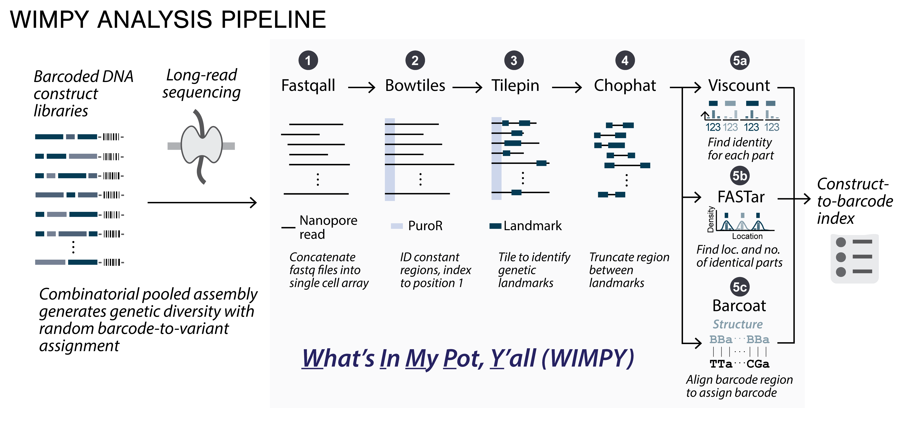

# WIMPY: A software package for nanopore sequencing analysis of combinatorial genetic libraries of arbitrary length scales

<!-- TODO: add link to preprint/journal -->
Checkout the full article at [OUP Bioinformatics]()!



`wimpy` (What’s In My Pot, Y’all) is a software package with implementations in both python and MATLAB, that can analyze large-scale pooled libraries of synthetic DNA. WIMPY leverages features that are unique to libraries of synthetic DNA, such as known locations of expected diversity flanked by constant sequences, and uses localized containment search algorithms for rapid and accurate variant assignment on a single-read basis, without relying on any consensus-based sequence aggregation methods.

## Getting Started - Python

We recommend running `wimpy` with UNIX-based operating system (Linux/MacOS). For Windows users we recommend using [Windows Subsystem for Linux (WSL 2)](https://learn.microsoft.com/en-us/windows/wsl/install) for better compatibility (although it should also be compatible with Windows installation of Python and Anaconda, but it's not officially supported yet).

### Download Conda and Clone Repository

Install [Miniconda](https://docs.anaconda.com/miniconda/install/#quick-command-line-install) (recommended) or [Anaconda](https://docs.anaconda.com/anaconda/install/). For Miniconda you can install it with the following commands:

- Linux/WSL:

    ```bash
    mkdir -p ~/miniconda3
    wget https://repo.anaconda.com/miniconda/Miniconda3-latest-Linux-x86_64.sh -O ~/miniconda3/miniconda.sh
    bash ~/miniconda3/miniconda.sh -b -u -p ~/miniconda3
    rm ~/miniconda3/miniconda.sh
    ```

- MacOS (M1 or later):

    ```bash
    mkdir -p ~/miniconda3
    curl https://repo.anaconda.com/miniconda/Miniconda3-latest-MacOSX-arm64.sh -o ~/miniconda3/miniconda.sh
    bash ~/miniconda3/miniconda.sh -b -u -p ~/miniconda3
    rm ~/miniconda3/miniconda.sh
    ```

Clone the repository into your local directory:

```bash
git clone git@github.com:cbashorlab/WIMPY.git
```

### Setting Up Environment and Package

Open folder `wimpy_python`:

```bash
cd ./WIMPY/wimpy_python
```

create `wimpy` virtual environment from the `environment.yml` file:

```bash
conda env create -f environment.yml
```

activate the environment:

```bash
conda activate wimpy
```

To use `wimpy` as a package, install it with the following command:

```bash
pip install -e .
```

### Using WIMPY

Checkout our example scripts [`example_script_python.ipynb`](./wimpy_python/example_script_python.ipynb) or [`example_live_script_matlab.mlx`](./WIMPY/wimpy_matlab/) for a detailed walkthrough on how to use `wimpy` to process sequencing files with data from [Ultra-high throughput mapping of genetic design space](https://www.biorxiv.org/content/10.1101/2023.03.16.532704v2).


## Getting Started - MATLAB

- Install the latest version of [MATLAB](https://www.mathworks.com/help/install/ug/install-products-with-internet-connection.html)
- Clone the repository into your local directory:

    ```bash
    git clone git@github.com:cbashorlab/WIMPY.git
    ```

- Open folder `wimpy_matlab` in MATLAB
- Add `wimpy_helper_functions` to path by running the following command on your MATLAB console:

    ```MATLAB
    addpath('./wimpy_helper_functions')
    ```

  - Alternatively, you can add `wimpy_helper_functions` to path by going to "Current Folder" -> rightclick `wimpy_helper_functions` -> "Add to Path" -> "Selected Folder"

- Checkout [`example_script_matlab.m`](./wimpy_matlab/example_script_matlab.m) for an exmple of how to use `wimpy` to process sequencing files in a pipeline.

## WIMPY Function Documentation

### `fastqall` (*fast-"call"*)

Combines reads from all fastq files in the directory, which are by default split into 4000-read blocks by Guppy/Dorado, into a single cell array while discarding sequence headers and information about per-base quality scores. Outputs a single array with all the reads, an array containing read lengths, and another containing per-base quality scores.

### `bowtile`

Indexes the reads and tethers them to a common reference point in the plasmid library. In the manuscript, and our example scripts, we use the C-terminus of the puroR cassette (puro), which should be contained in all level-3 plasmid assemblies. Reads in which puroR is not detected are discarded at this stage, while on-target reads are reconstructed so the reference sequence is located on the 5’ end of the top strand (reads from the opposite orientation are reverse complemented). The output of `bowtile` is a n-by-1 cell array containing all reads indexed to PuroR.

### `tilepin`

Identifies library-specific constant landmarks in each read using a containment search and indexes the locations of these landmarks for later use. Examples of invariant genetic landmarks include fluorescent reporters, such as mRuby, the Ert2 domain, or the BFP fluorescent protein in the barcoded EU present in data from the library analyzed in our manuscript and example scripts. The inputs to `tilepin` are the cell array containing all the reads, and DNA sequences representing identifiable landmarks (i.e., mRuby and BFP). The output is an n-by-1 integer array (where n is the read depth on the library), and the column contains the position of the landmark.

The python implementation of `wimpy` contains an upgraded version, `tilepin_v2`, which utilizes hashmaps and therefore has better performance than the original `tilepin`. See the end of [`example_script_python.ipynb`](./wimpy_python/example_script_python.ipynb) for performance comparison.

### `chophat`

Truncates reads based on landmark coordinates identified by `tilepin`, yielding a n-by-1 cell array, that contains reads truncated between landmarks (e.g.- between mRuby and BFP). The inputs to `chophat` are the n-by-1 cell array containing all nanopore reads (Bowtiles output) and the n-by-1 or n-by-2 integer array specifying landmark indices within each read (`tilepin` output). The output contains truncated nanopore reads. The outputs from `chophat` can be used downstream with `viscount`/`fastar` for variant assignment, or `barcoat` barcode sequence determination.

### `viscount`

Uses containment search to query a defined sub-section of each read against a shortlist of genetic part sequences to make part identity assignments. The inputs to `viscount` are reads from `chophat` and a reference cell array containing the sequences of all possible genetic parts within a category (e.g., all 4 promoter variants) (Fig. 1C). The containment search works as follows:

1. each reference genetic part sequence is split into tiles in a user-defined manner. For this study we used tile lengths of 10 bp for most parts. Generally, for sequences > 50bp in length, 10bp tiles work well. For smaller sequences, we advise dropping down the tile size (to 6-8bp), but raising the threshold (see below), as smaller tiles are more likely to be found in a read that doesn't contain the reference part.
2. All reads are queried for all tiles for every reference sequence using a binary containment search.
3. The number of tiles contained in each read is counted for all reference sequences;
4. The number of tiles assigned to each read is normalized by the total number of reference tiles to account for variable reference sequence lengths, yielding the fraction of tiles contained in each read for each reference sequence.
5. If a read contains more tiles than the specified threshold (user defined, typically ~3-5% for reference sequences >50bp, 20-40% for smaller reference sequences) for a given reference sequence, it is assigned a part identity. Reads can receive more than one part identity by meeting the threshold for multiple parts within the category; such reads are referred to as “confused” reads and are potentially a product of noisy sequencing data.

The outputs from this process are normalized and non-normalized tile-count containing n-by-m matrices (n: number of reads, m: number of reference parts), and a confusion matrix showing the number of reads that were assigned to one part (diagonal of the matrix) and two parts (off-diagonal elements). In our study, reads in which a part could not be unambiguously identified are assigned “-`”, while confused reads are assigned “-1”. All -1 reads identified by this analysis are subsequently discarded.

### `fastar` (*FASTar*)

Uses the same containment search method as `viscount` (mentioned above), and operates on the same input cell array, but is used in instances where multiple copies of an identical sequence are present, such as arrays of binding sites, and the goal is to capture their location (relative to each other or absolute location in the read). The function runs identically to `viscount`, querying reads from the cell array output from chophat and performing a containment search for tiles, and records the counts as well as the locations of the tiles along a read. This is then followed by running a kernel density filter on the locations of the tiles along each read with a user defined bandwidth, which is intended to be set based on the size of the part as well as relative expected distance between the parts. A search for local maxima of the kernel density output then returns the number of such identical parts (e.g., BMs), and their relative locations along the read. The outputs from this function are an array that contains the number of peaks identified in each read in the array, and a cell array that contains the location of each of the peaks for each read. Any reads in which the part could not be identified are assigned “0” in both the location and count outputs by this analysis, and are subsequently discarded.

### `barcoat`

Leverages semi-degenerate barcode structures (such as BBA/DDC structures in our barcoding scheme) to identify barcodes using a custom alignment matrix with a 0 penalty for on target alignments (“B to B” or “D to D”), and -5 penalty for unexpected alignments (“A to B” or “C to D”) in the barcode region. The `barcoat` input is a cell array containing reads where barcodes may be present, ie downstream of the BFP coding sequence in our example. Sequences with a perfect alignment score and length (18 bp) are saved directly. 

The `barcoat` output allows for potential error correction downstream, in the presence of an illumina or other high-accuracy NGS generated ground-truth table. In our study, in fig. S1C, sequences with 1 mismatch/indel in the constant tethered bases (A for BC1, C for BC2) were corrected by adding back the constant tethered base and then saved. Sequences with a mutation/indel in the variable region were then queried against the short-read sequencing data obtained from flow-seq experiments. If a match was found in the region containing the mutation/indel, the sequence was corrected based on the illumina reference. Sequences with two or more mismatches/indels were discarded. We do note that at the moment, we have chosen to not provide error correction capabilities, to keep the functionality of the pipeline simple and minimal. We may consider integrating it in the future if users would prefer. For our current error correction scripts, please contact Kshitij rai, Kshitij.Rai@rice.edu, or Yiduo Wang (yiduo@rice.edu)