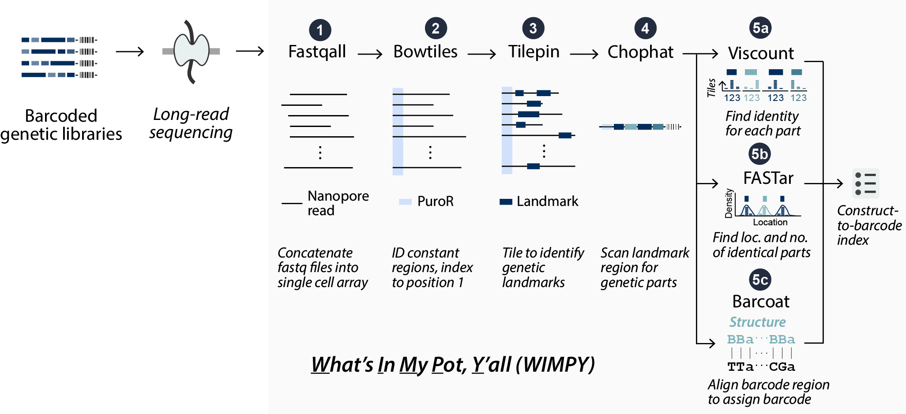

# WIMPY: A software package for nanopore sequencing analysis of combinatorial genetic libraries of arbitrary length scales

<!-- TODO: add link to preprint/journal -->
Checkout the full article at [OUP Bioinformatics]()!



`wimpy` (What’s In My Pot, Y’all) is a software package with implementations in both python and MATLAB, that can analyze large-scale combinatorial libraries of synthetic DNA. WIMPY leverages features that are unique to libraries of synthetic DNA, such as known locations of expected diversity flanked by constant sequences, and uses localized containment search algorithms for rapid and accurate variant assignment on a single-read basis, without relying on any consensus-based sequence aggregation methods.

## Getting Started - Python

We recommend running `wimpy` with UNIX-based operating system (Linux/MacOS). For Windows users we recommend to use [Windows Subsystem for Linux (WSL 2)](https://learn.microsoft.com/en-us/windows/wsl/install) for better compatibility (although it should also be compatible with Windows installation of Python and Anaconda, but it's not officially tested).

### Download Conda and Clone Repository

Install [Miniconda](https://docs.anaconda.com/miniconda/install/#quick-command-line-install) (recommended) or [Anaconda](https://docs.anaconda.com/anaconda/install/). For Miniconda you can install it with the following commands:

- Linux/WSL:

    ```bash
    mkdir -p ~/miniconda3
    wget https://repo.anaconda.com/miniconda/Miniconda3-latest-Linux-x86_64.sh -O ~/miniconda3/miniconda.sh
    bash ~/miniconda3/miniconda.sh -b -u -p ~/miniconda3
    rm ~/miniconda3/miniconda.sh
    ```

- MacOS (M1 or later):

    ```bash
    mkdir -p ~/miniconda3
    curl https://repo.anaconda.com/miniconda/Miniconda3-latest-MacOSX-arm64.sh -o ~/miniconda3/miniconda.sh
    bash ~/miniconda3/miniconda.sh -b -u -p ~/miniconda3
    rm ~/miniconda3/miniconda.sh
    ```

Clone the repository into your local directory:

```bash
git clone git@github.com:cbashorlab/WIMPY.git
```

### Setting Up Environment and Package

Open folder `wimpy_python`:

```bash
cd ./WIMPY/wimpy_python
```

create `wimpy` virtual environment from the `environment.yml` file:

```bash
conda env create -f environment.yml
```

activate the environment:

```bash
conda activate wimpy
```

To use `wimpy` as a package, install it with the following command:

```bash
pip install -e .
```

Checkout [`example_script_python.ipynb`](./wimpy_python/example_script_python.ipynb) for an exmple of how to use `wimpy` to process sequencing files in a pipeline.

## Getting Started - MATLAB

- Install the latest version of [MATLAB](https://www.mathworks.com/help/install/ug/install-products-with-internet-connection.html)
- Clone the repository into your local directory:

    ```bash
    git clone git@github.com:cbashorlab/WIMPY.git
    ```

- Open folder `wimpy_matlab` in MATLAB
- Add `wimpy_helper_functions` to path by running the following command on your MATLAB console:

    ```MATLAB
    addpath('./wimpy_helper_functions')
    ```

  - Alternatively, you can add `wimpy_helper_functions` to path by going to "Current Folder" -> rightclick `wimpy_helper_functions` -> "Add to Path" -> "Selected Folder"
