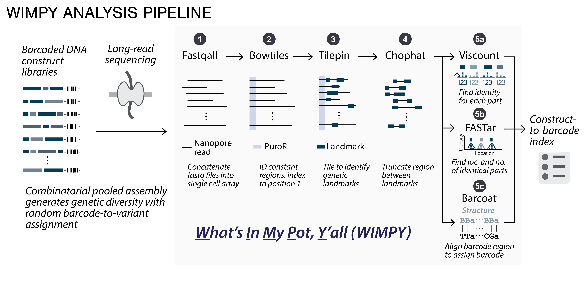

# WIMPY: A software package for nanopore sequencing analysis of combinatorial genetic libraries of arbitrary length scales

<!-- TODO: add link to preprint/journal -->
Manuscript available soon!



`wimpy` (What’s In My Pot, Y’all) is a software package that can analyze large-scale pooled libraries of synthetic DNA. The implementation is available in both Python and MATLAB, depending on the user’s preferred programming language.

`wimpy` leverages features that are unique to libraries of synthetic DNA, such as known locations of expected diversity flanked by constant sequences, and uses localized containment search algorithms for rapid and accurate variant assignment on a single-read basis, without relying on any consensus-based sequence aggregation methods.

## Getting Started - Python Version

We recommend running `wimpy` with UNIX-based operating system (Linux/MacOS). For Windows users, we recommend using [Windows Subsystem for Linux (WSL 2)](https://learn.microsoft.com/en-us/windows/wsl/install) for better compatibility (although it should also be compatible with Windows installation of Python and Anaconda, but it's not officially supported yet).

### Download Conda and Clone Repository

Install [Miniconda](https://docs.anaconda.com/miniconda/install/#quick-command-line-install) (recommended) or [Anaconda](https://docs.anaconda.com/anaconda/install/). For Miniconda you can install it with the following commands:

- Linux/WSL:

    ```bash
    mkdir -p ~/miniconda3
    wget https://repo.anaconda.com/miniconda/Miniconda3-latest-Linux-x86_64.sh -O ~/miniconda3/miniconda.sh
    bash ~/miniconda3/miniconda.sh -b -u -p ~/miniconda3
    rm ~/miniconda3/miniconda.sh
    ```

- MacOS (M1 or later):

    ```bash
    mkdir -p ~/miniconda3
    curl https://repo.anaconda.com/miniconda/Miniconda3-latest-MacOSX-arm64.sh -o ~/miniconda3/miniconda.sh
    bash ~/miniconda3/miniconda.sh -b -u -p ~/miniconda3
    rm ~/miniconda3/miniconda.sh
    ```

Clone the repository into your local directory:

```bash
git clone git@github.com:cbashorlab/WIMPY.git
```

### Setting Up Environment and Package

Open folder `wimpy_python`:

```bash
cd ./WIMPY/wimpy_python
```

create `wimpy` virtual environment from the `environment.yml` file:

```bash
conda env create -f environment.yml
```

activate the environment:

```bash
conda activate wimpy
```

To use `wimpy` as a package, install it with the following command:

```bash
pip install -e .
```

## Getting Started - MATLAB Version

- Install the latest version of [MATLAB](https://www.mathworks.com/help/install/ug/install-products-with-internet-connection.html)
- Clone the repository into your local directory:

    ```bash
    git clone git@github.com:cbashorlab/WIMPY.git
    ```

- Open folder `wimpy_matlab` in MATLAB
- Add `wimpy_helper_functions` to path by running the following command on your MATLAB console:

    ```MATLAB
    addpath('./wimpy_helper_functions')
    ```

  - Alternatively, you can add `wimpy_helper_functions` to path by going to "Current Folder" -> rightclick `wimpy_helper_functions` -> "Add to Path" -> "Selected Folder"

- Checkout [`example_script_matlab.m`](./wimpy_matlab/example_script_matlab.m) for an exmple of how to use `wimpy` to process sequencing files in a pipeline.

## Using WIMPY

Checkout our example scripts [`example_script_python.ipynb`](./wimpy_python/example_script_python.ipynb) or [`example_live_script_matlab.mlx`](./WIMPY/wimpy_matlab/) for a detailed walkthrough on how to use `wimpy` to process sequencing files with data from [Ultra-high throughput mapping of genetic design space](https://www.biorxiv.org/content/10.1101/2023.03.16.532704v2).

## Algorithm Overview

ONE LINE OVERVIEW OF INTRODUCTION REWRITE LATER DO NOT FORGET

List all the functions

### `function`

simplified discription (one line)

for all the functions

## Example Usage and Parameter Selection

### `fastqall` (*fast-"call"*)

Parse reads from all fastq files in the specified directory into a single cell array.

#### Input

- `directory`: the location of files. Defaults to './'
- `prefix`: the specified prefix. Defaults to ''.

#### Parameters

- `idx_start`: start index of the file names. Defaults to None.
- `idx_end`: end index of the file names. Defaults to None.

#### Returns

- `q_scores`: quality scores of all reads
- `lengths`: lengths of all reads
- `seqs`: sequence of all the reads

#### Example

```python
>>> from wimpy import wimpy as wp
>>> q_scores, lengths, seqs = wp.fastqall("./example_fastq")
>>> print("Number of reads:", len(seqs))
>>> print("50 bp of the first sequence:", seqs[0][:50])
```

```python
>>> q_scores, lengths, seqs, names = wp.fastqall(
...     directory="./example_fastq", 
...     prefix="fastq_runid",
...     idx_start=0,
...     idx_end=1,
...     return_names=True,
... )
>>> for i in range(5):
...     print("----")
...     print("name:", names[i])
...     print("length:", lengths[i])
...     print("first 50 quality score:", q_scores[i][:50])
...     print("first 50 bp of sequence:", seqs[i][:50])
```

### `bowtile`

use containment search of the fragmented tiles of the reference sequence to determine the occurence of a sequence in a list of reads. Tether all reads to a common reference point.

#### Input

- `seqs`: a list of reads to be tiled to
- `ref`: the reference sequence

#### Parameters

- `thresh`: threshold to determine whether the tiling is valid. Defaults to 0.03.
- `tile_len`: length of tile. Defaults to 10.
- `max_len`: maximum length of ref seq. Defaults to 100.
- `verbose`: print out progress. Defaults to False.

#### Returns

- `new_seq`: valid sequences that are aligned to start with ref seq
- `right_seq`: valid sequences that are not re-indexed
- `flip`: whether the match is on fwd strand (0), rev
    strand (1), or no match (-1)

#### Example

```python
>>> seqs = [
...     "ATGCGTACGTAGCTAGCTAGCTAGCTAGCTAGCTAGC",
...     "GCTAGCTAGCTAGCTAGCTAGCTACGTACGTACGTAC",
...     "TGCATGCATGCATGCATGCATGCATGCATGCATGCAT"
... ]
>>> ref = "ATGCGTACGTAGCTAGCTAGC"

>>> # Run bowtile
>>> new_seq, right_seq, flip = wp.bowtile(seqs, ref, thresh=0.03, tile_len=5, max_len=20)
>>> print("New Sequences:", new_seq)
>>> print("Original Sequences:", right_seq)
>>> print("Strand Orientation (0=fwd, 1=rev, -1=fail):", flip)
```

### `tilepin` (`tilepin_v2`)

Identifies library-specific constant landmarks in each read using a containment search and indexes the locations of these landmarks for later use.

The python implementation of `wimpy` contains an upgraded version, `tilepin_v2`, which utilizes hashmaps and therefore has better performance than the original `tilepin`. See the end of [`example_script_python.ipynb`](./wimpy_python/example_script_python.ipynb) for performance comparison.

#### Input

- `seqs`: input sequences to search
- `ref`: the reference sequence

#### Parameters

- `thresh`: threshold to determine if the sequence contains the reference sequence. Defaults to 0.03.
- `tile_len`: length of tile. Defaults to 10.
- `verbose`: print out progress. Defaults to False.

#### Returns

- `num_matches`: the number of tiles matched the sequence
- `match_index`: the index where the reference sequence is located.
- `matches`: the list of all indices where match is found

#### Example

```python
>>> seqs = [
...     "ATGCGTACGTAGCTAGCTAGCTAGCTAGCTAGCTAGC",
...     "CTAGCCATACTCGGACATGCGTACGTATCTAGCTAGC",
...     "TGCATGCATGCATGCATGCATGCATGCATGCATGCAT"
... ]
>>> ref = "ATGCGTACGTAGCTAGCTAGC"
>>> num_matches, match_index, matches = wp.tilepin_v2(seqs, ref, thresh=0.03, tile_len=5)
>>> print("Number of matches:", num_matches)
>>> print("Match index:", match_index)
>>> print("Matches array:", matches)
```

### `chophat`

Truncates sequences to keep only the regions of interest.

#### Input

- `seqs`: sequences to be processed.

#### Parameters

- `positions`: start position for truncation
- `end_positions`: end position for truncation. Defaults to None.
- `max_length`: the max length of truncated sequence. If max_length is None, the truncated sequence will be from the start position to the end of string. Defaults to None.
- `retain`: retain the sequence if the start position to the end of string is smaller than max_length. Defaults to True.

#### Returns

- `truncated_sequences`: the truncated sequences

#### Example

```python
>>> import numpy as np
>>> seqs = [
...     "ATGCGTACGTAGCTAGCTAGCTAGCTAGCTAGCTAGC",
...     "GCTAGCTAGCTAGCTAGCTAGCTACGTACGTACGTAC",
...     "TGCATGCATGCATGCATGCATGCATGCATGCATGCAT"
... ]
>>> positions = np.array([0, 5, 10])
>>> end_positions = np.array([10, 20, 30])
>>> truncated_seqs = wp.chophat(seqs, positions, end_positions, max_length=15)
>>> print(truncated_seqs)
```

### `viscount`

Counts the number of occurence of tiles in a list of reference sequences. The output is used for identifying which part in the reference list is identified in the given sequence.

`viscount` is designed to be connected to `chophat`, where sequences is first truncated with `chophat` and taken by `viscount` for part identification.

Construct and return a confusion matrix of index assignments if requested.

#### Input

- `seqs`: sequences to be processed.
- `ref_seqs`: list of reference sequences.

#### Parameters

- `thresh`: threshold for a valid occurence in confusion matrix
- `return_confusion_matrix`: construct the confusion matrix or not. Defaults to True.
- `tile_len`: length of tiles. Defaults to 10.
- `verbose`: printing out progress. Defaults to False.

#### Returns

- `match_ratios`: the proportion of reference tiles that get assigned to
the sequences.
- `match_counts`: the raw count of number of tiles get assigned to the sequences.
- `conf_matrix`: confusion matrix for the assignment

#### Example

```python
>>> seqs = [
...     "ATGCGTACGTAGCTAGCTAGCTAGCTAGCTAGCTAGC",
...     "GCTAGCTAGCTAGCTAGCTAGCTACGTACGTACGTAC",
...     "TGCATGCATGCATGCATGCATGCATGCATGCATGCAT"
... ]
>>> ref_seqs = ["ATGCGTACGTAGCTAGCTAGC", "CATGCATGCATGCATGCA"]
>>> match_ratios, match_counts, conf_matrix = wp.viscount(seqs, ref_seqs, thresh=0.03, tile_len=5)
>>> print("Match Ratios:\n", match_ratios)
>>> print("Match Counts:\n", match_counts)
>>> print("Confusion Matrix:\n", conf_matrix)
```

### `fastar` (*FASTar*)

Identify the number of occurences and their indexes in the sequence. The function runs identically to `viscount`, querying reads from the cell array output from chophat and performing a containment search for tiles, and records the counts as well as the locations of the tiles along a read.

#### Input

- `seqs`: list of sequence to search within.
- `ref`: reference sequence.

### Parameters

- `tile_len`: size of tile for sliding window.
- `bw`: bandwidth for kernel density estimation.

#### Returns

`nums`: number of local maxima found in each sequence.
`locs`: list of locations of local maxima for each sequence.

#### Example

```python
>>> seqs = [
...     "ACTGATCGACTGATCGACTGATGGACTGATCGACTG",
...     "GCTAGCTAGCTAGACTGATCGAGCTACGTAACGTAC",
...     "TGCATGCATGCATGCATGCATGCATGCATGCATGCAT"
... ]
>>> ref = "ACTGAT"
>>> nums, locs = wp.fastar(seqs, ref, tile_len=3)
>>> print("Number of local maxima:", nums)
>>> print("Locations of local maxima:", locs)
```

### `barcoat`

Leverages semi-degenerate barcode structures (such as BBA/DDC structures in our barcoding scheme) to identify barcodes using a custom alignment matrix.

#### Input

- `seqs`: List of sequences to be aligned.

#### Parameters

- `preset`: Preset configuration for barcode construct and aligner. Options are "BBA", "DDC", or None. Default is "BBA".
- `barcode_construct`: Custom barcode construct sequence. Required if `preset` is None.
- `aligner`: Custom aligner object. Required if `preset` is None.

#### Returns

- `barcode`: Array of aligned barcode sequences.
- `position`: Array of starting positions of alignments.
- `length`: Array of lengths of alignments.
- `score`: Array of alignment scores.

#### Example

Using preset aligner and barcode construct

```python
>>> seqs = ["TCATGACTAGCATCAGGATCAACGTA", "CTAGGTTTAGCACCACTATGAACTGA"]
>>> barcode, position, length, score = wp.barcoat(seqs, preset="BBA")
>>> print(barcode, position, length, score, sep="\n")
```

Using customized aligner

```python
>>> from Bio.Seq import Seq
>>> from Bio import Align
>>> import numpy as np
>>> seqs = ["ATTATTATTATTATTATTA", "CTTCTTCTTCTTCTTCTTC"]
>>> barcode_construct = Seq("ATTATTATTATTATTATTA")
>>> aligner = Align.PairwiseAligner()
>>> aligner.mode = "local"
>>> aligner.substitution_matrix = Align.substitution_matrices.Array(
...     data=np.array(
...         [[5, -5, -5, -5], [-5, 5, 5, 5], [-5, 5, 5, 5], [-5, 5, 5, 5]]
...     ),
...     alphabet="ATGC",
... )
>>> aligner.open_gap_score = -8
>>> aligner.extend_gap_score = -8
>>> barcoat(seqs, preset=None, barcode_construct=barcode_construct, aligner=aligner)
```
