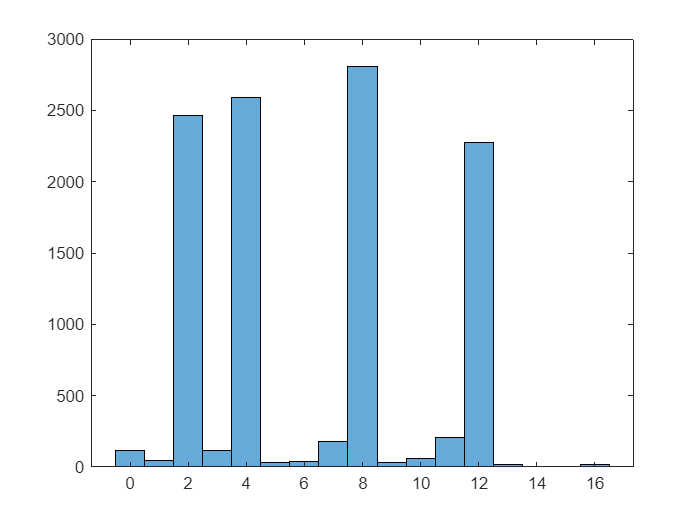

# Analyzing a subset of data from "Ultra\-high throughput mapping of genetic design space"

Check out our preprint [here](https://www.biorxiv.org/content/10.1101/2023.03.16.532704v2) for additional biological context!


Let's start by making sure the `wimpy helper functions` are added to our path. We'll be making use of these functions to analyze our entire dataset.


First, make sure you are in the `wimpy_matlab` folder already. Then add the helper functions to matlab's path as follows \-

```matlab
addpath('./wimpy_helper_functions/')
```
# About the dataset

The dataset comes from the preprint linked above, and consists of a 2\-gene genetic circuit, where one gene encodes a synthetic transcription factor, or SynTF, while the other encodes a GFP reporter. Ten different genetic elements along this 2\-gene circuit were diversified in the study, with 2\-4 different variants present along each category. The variants diversified are shown below \-


# Loading input data and reference sequences

We have a number of constant sequences in this library that we will use as various points as "landmarks": constant regions surrounding regions of expected diversity, such as an A4 chromatin insulator upstream, and GFP downstream of the region where we expect our BM arrays, and minimal promoters to be.


These sequences are of variable sizes, ranging from ~200 bp (A4), to >700bp (GFP, mRuby etc). We start by loading in these reference sequences, and trimming them down to only retain ~100bp, which is enough for WIMPY to unambiguously identify them from the nanopore reads. Making the reference sequences smaller in size helps speed up the landmark identification steps we'll be doing downstream. So you can skip the trimming of the sequences, but note that the runtime to identify these in your reads will be longer if so.


Trimming the landmark sequences can be done from anywhere (beginning/middle/end of the read), but ideally you want to pick a region of the landmark sequence that is unambiguous and found uniquely in the read. In our example, all landmark sequences are unique, and we use a mix of trimming from the middle (e.g. with mRuby and BFP) and the end (e.g. \- GFP, A4) for illustrative purposes.

```matlab
ref_seqs = struct2cell(fastaread('../example_ref_sequences/ref_sequences.fasta'));

Puro = upper(cell2mat(ref_seqs(2, contains(ref_seqs(1, :), 'Puro'))));
GFP = upper(cell2mat(ref_seqs(2, contains(ref_seqs(1, :), 'GFP'))));
A4 = upper(cell2mat(ref_seqs(2, contains(ref_seqs(1, :), 'A4'))));
A4 = A4(end-50:end);
minP = upper(cell2mat(ref_seqs(2, contains(ref_seqs(1, :), 'minP'))));
mRuby = upper(cell2mat(ref_seqs(2, contains(ref_seqs(1, :), 'mRuby'))));
mRuby = mRuby(200:300);
BFP = upper(cell2mat(ref_seqs(2, contains(ref_seqs(1, :), 'BFP'))));
BFP = BFP(200:300);
BS10_1 = upper(cell2mat(ref_seqs(2, contains(ref_seqs(1, :), 'BS10_1'))));
```

Next, we'll load our variable sequences, that were diversified in the study

```matlab
ZF_parts = ref_seqs(2, 7:9)';
minP_100k = readcell('../example_ref_sequences/100k_Minimal-Promoters.xlsx'); minP_100k = minP_100k(2:end, 2);
terminators_100k = readcell('../example_ref_sequences/100k_Terminators.xlsx'); terminators_100k = terminators_100k(2:end, 2);
spacers_100k = readcell('../example_ref_sequences/100k_Terminator_spacers.xlsx'); spacers_100k = spacers_100k(2:end, 2);
promoters_100k = readcell('../example_ref_sequences/100k-Promoters.xlsx'); promoters_100k = promoters_100k(2:end, 2);
ORF_parts = readcell('../example_ref_sequences/100k_ORF-Parts_SynTF.xlsx'); 
AD_parts = ORF_parts(2:5, 3); IDR_parts = ORF_parts(6:9, 3);
```
# Step 1: Consolidate reads with `fastqall`

We load the input Nanopore sequencing files with `fastqall`, and filter out all reads that are not within the expected size range (9500 to 15000 bp in this case):

```matlab
%load in data using fastqall function
[~, l, seq] = fastqall('../example_fastq', 'fastq');
```

```matlabTextOutput
62.5%
29.4777%
58.9553%
88.433%
```

```matlab
%Visualize read length histogram
figure(1); histogram(l(l < 20000)/1000, 1000, 'EdgeColor','none')
xlabel('Length (kb)'); title('Raw Read Length Histogram')
```


```matlab
%Filter based on read length
seq = seq(l > 9500 & l < 15000); l = l(l > 9500 & l < 15000);

%Visualize read length histogram
figure(2); histogram(l/1000, 100, 'EdgeColor','none')
xlabel('Length (kb)'); title('Filtered Read Length Histogram')
```


# Step 2: Orient reads and tether to reference sequence with `bowtile`

In this example, every read should contain a puromycin (`Puro`) resistance gene which is present directly upstream of all expected diversity in the library. Therefore, we use `Puro` as the anchor point and re\-index all reads to start with `Puro`.


The fastq file from nanopore contains plasmids that are read both in forward and reverse\-complement direction. The ones sequences in reverse are flipped by `bowtile` so the ouput is all in forward direction.


We will also get rid of any reads where `Puro` wasn't found, marked in the `new_seq` output variable as `'X'`

```matlab
%Index to Puromycin using bowtile
thresh = 0.03;
[new_seq, ~, ~, ~, ~, ~] = bowtile(seq, Puro, thresh);
```

```matlabTextOutput
Bowtiling to Puro
```

```matlab
%Remove any reads that didn't align to Puro (marked as 'X' in new_seq)
reads_correct = new_seq(~contains(new_seq, 'X')); l_readscorrect = l(~contains(new_seq, 'X'));
```
# Step 3: Part Identification

This part of the script deals with part assignments in all variable regions. This is done via a combination of 3 steps, ie \- 

1.  Tilepin \- to identify constant regions upstream and downstream of any given region of expected diversity.
2. Chophat \- trim regions in between the identified landmarks, to create a truncated array that is expected to contain variable sequences, and
3. (A) Viscount \- identify part assignment from a list of candidate parts that could be present in a given region (such as one of four possible promoters), or (B) Fastar \- identify location and number of repeats for a given singular sequence (such as repeated arrays of a binding motif (BM) sequence)
## Locating key landmarks

Locate key landmark regions via `tilepin` (note \- the python implementation of wimpy offers an upgraded version of the original `tilepin` called tilepin\_v2, which uses hashmaps to improve performance and run faster on python than `tilepin`. However, the matlab implementation of tilepin does still offer a comparable performance to `tilepin_v2`). We use the index of these landmarks to help locate the varied regions with multiple parts.


`tilepin` generates three outputs;

1.  The number of reference k\-mers found in a read,
2. The median position of the reference k\-mer, and
3. The indices of all k\-mers found in the read

Since we only need the median location of these landmarks for truncation downstream, we discard the first and third outputs, and retain only the second. We do this for a number of landmark sequences that will be required for truncating different regions of expected diversity by `chophat` later on.

```matlab
[~, positionsA4, ~] = tilepin(reads_correct, A4, thresh, 'F');
```

```matlabTextOutput
Tilepinning for A4
```

```matlab
[~, positionsGFP, ~] = tilepin(reads_correct, GFP(end-100:end), thresh, 'F');
```

```matlabTextOutput
Tilepinning for 
```

```matlab
[~, positionsminP, ~] = tilepin(reads_correct, minP, thresh, 'F');
```

```matlabTextOutput
Tilepinning for minP
```

```matlab
[~, positionsmRuby, ~] = tilepin(reads_correct, mRuby(end-100:end), thresh, 'F');
```

```matlabTextOutput
Tilepinning for 
```

```matlab
[~, positionsBFP, ~] = tilepin(reads_correct, BFP, thresh, 'F');
```

```matlabTextOutput
Tilepinning for BFP
```

```matlab
positions2 = floor([positionsA4, positionsGFP, positionsminP, positionsmRuby, positionsBFP]);
```
## Reporter identification

We start by identifying the parts within the repoter expression unit. To start, we cut out promoter and terminator regions with `chophat`, which truncate the sequence based on a starting landmark, and either a ending landmark or a max region length. In our example, we create two truncated regions:

-  `p_regions`: promoter region, flanked between A4 chromatin insulator and GFP: contains the number of BM repeats, and minimal promoter 
-  `t_regions`: terminator region, starting with GFP and ≤ 2000 bp from it: contains the terminator spacer 
```matlab
%pregions and tregions using chophat
pregions = chophat(reads_correct, positions2(:, 1:2), 0, 0);
tregions = chophat(reads_correct, positions2(:, 2), 2000, 1);
```
## Assigning minimal promoters (`pMin`)

`p_regions` contains a minimal promoter, which can be one of the three variants (`minP_100k`). Here we'll use `viscount` to assign reads to their corresponding minimal promoter variant.


Since the sequence of minimal promoter is small, we use a smaller k\-mer size of 6bp, instead of the default 10bp. This could increase the misassignment rate, as smaller tiles (k\-mers) are more likely to be found in off\-target regions by chance. As such, we increase the threshold for the proportion of k\-mers required to be considered for a positive assignment, to accomodate for this higher likelihood of errors

```matlab
%Run viscount with a k-mer size of 6, and threshold of 0.2. Produce a
%confusion matrix by setting the final argument to 'T'
[minP_variants_scaled, ~, minPconf] = viscount(pregions, 6, minP_100k, 0.2, 'T');
```

```matlabTextOutput
Viscounting for minP_100k
```

```matlab

%Add in the max assignment as the 4th column of the minP_variants_scaled
%variable
[~,minP_variants] = max(minP_variants_scaled, [], 2);
%Assign any reads that contained less than 20% of tiles against a reference
%sequence to 0 (as they cannot be confidently assigned)
minP_variants((sum(minP_variants_scaled(:,1:3),2) < 0.2)) = 0;

%Visualize the confusion chart
confusionchart(minPconf)
```


## Assign number of binding sites (using `fastar`)

Since `BS10_1` is the same sequence but repeated a variable number of times, we'll use fastar to assign the number of instances of this sequence in a given read. Using `BS10_1` as a reference sequence in the `p_regions` array, we can find the number (and location, though that isn't needed in this example) of binding sites in every read. 


The inputs `fastar` needs are k\-mer size (same as `viscount` above), and an additional `bandwidth` parameter. This is used to run kernel density searches to identify the numbers and exact locations of repeated sequences in the function. Typically, a good estimate for the bandwidth parameter is between 0.5\-1.5 times the size of the repeated sequence. For isntance \- 

-  For a TF binding motif (such as BS10\_1), a good range for the BW parameter is between 5\-25bp. Set it on the higher side if there's an expected large gap between repeats, but on the lower side if they are clustered close together. 
-  For an enhancer sequence of say ~50 bp, a good range for the bandwidth would be 30\-100. 

Since we know the reads can only contain 2, 4, 8 or 12 binding sites, we correct some of the assignments in bins nearby (such as 7 or 9 BMs instead of 8) to the appropriate number

```matlab
%Run fastar with a tile size of 6bp, and a bandwidth for kernel density of
%8 (default)
[variants_bs, ~] = fastar(pregions, BS10_1, 6, 8);

%View assignments
histogram(variants_bs)
```



```matlab
%Correct nearby assignments
variants_bs(variants_bs > 6.9 & variants_bs < 9.1) = 8;
variants_bs(variants_bs > 9.2 & variants_bs < 14) = 12;
variants_bs(variants_bs > 3.9 & variants_bs < 6.1) = 4;
variants_bs(variants_bs ~= 2 & variants_bs ~= 4 & variants_bs ~= 8 & variants_bs ~= 12) = 0;

%Re-map the number of variants (2, 4, 8, 12) to assignments 1, 2, 3 & 4 for
%consistency and convenience downstream
variants_bs(variants_bs == 2) = 1; %2 binding sites
variants_bs(variants_bs == 4) = 2; %4 binding sites
variants_bs(variants_bs == 8) = 3; %8 binding sites
variants_bs(variants_bs == 12) = 4; %12 binding sites

%View cleaned up assignments
histogram(variants_bs)
```


## Assign terminator spacing

Assign the terminator spacer variants with `viscount`, similar to assigning minimal promoter variants. Note that here "No spacing" is an option too. So we tile for the 250 and 500bp spacers, and if tiles for neither of the two are found, we assign it to 0, or no spacing.


Another thing we have to be mindful of is the fact that the 500 bp spacer contains the 250bp spacer as well. As such, any read that contains the 500bp spacer will also have the entirety of the 250 bp spacer contained within it. We have two options to combat this issue \- 

1.  Run viscount with only the variable regions, ie bp 251\-500 of the 500bp spacer. If a sequence contains that spacer, it should have that sequence. Any reads that have the 250bp spacer but not the other spacer then, can be mapped to the 250bp spacer. However, all reads with the 500bp spacer would have both the 250bp spacer and the 500bp one as well. We'll need to account for that separately
2. (Recommended): Run visount with just the 500bp spacer. Reads that contain the entire 500bp spacer will form a peak at near 1 in the normalized tile histogram (since they should contain nearly 100% of the tiles), while those with the 250bp spacer will form a peak at ~0.5 (50% of the tiles). Those with no spacer will form a tall peak at 0 (none of the tiles). We will implement this method in our script here
```matlab
[spacer_tiles, ~, ~] = viscount(tregions, 10, spacers_100k(2), 0.2, 'F');
```

```matlabTextOutput
Viscounting for 
```

```matlab
%Visualize output (normalized tiles)
histogram(spacer_tiles, 100, 'EdgeColor','none')
xlabel('Proportion of 500bp spacer tiles')
```


```matlab
%As expected, there's a peak at 0, a peak near 0.5, and a final one near 1.
%Let's make assignments based on that

term_indices = ones(size(spacer_tiles)); %Initialize the array
term_indices(spacer_tiles > 0.2 & spacer_tiles < 0.52) = 2;
term_indices(spacer_tiles > 0.52) = 3;
```

Finally, let's consolidate all reporter assignments into one output variable

```matlab
reporter_variants = [variants_bs minP_variants term_indices];
```
## SynTF Assignments

Now we identify the parts in the SynTF unit, using a process similar to the one used to assign variants in the reporter unit. We start by using `chophat` to truncate regions based on indices identified earlier from `tilepin`, followed by `viscount` to assign variants


Let's start by making the `pregions` and `tregions` for synTF. 

-  For pregions, we'll go from the first bp (array of ones) up to the mRuby, which is in the middle of the synTF protein coding region (the 4th column of the `positions2` variable we made above). 
-  For tregions, we'll go from there to the A4 chromatin insulator (first column of positions2), which is directly upstream of the GFP (reporter) coding sequence. 
```matlab
pregions_synTF = chophat(reads_correct, [ones(size(positions2, 1), 1) positions2(:, 4)], 0, 0);
tregions_synTF = chophat(reads_correct, [positions2(:, 4) positions2(:, 1)], 0, 0);
```
## Promoter assignments

We'll use `viscount` on the `pregions_synTF` variable, with the promoters as reference sequences

```matlab
[synTFprom_variants_scaled, ~, synTFprom_conf] = viscount(pregions_synTF,10,promoters_100k, 0.03, 'T');
```

```matlabTextOutput
Viscounting for promoters_100k
```

```matlab
[~,variants_synTF_prom] = max(synTFprom_variants_scaled, [], 2);
variants_synTF_prom(sum(synTFprom_variants_scaled,2) < 0.03) = 0;

%Visualize assignment confusion matrix
figure; confusionchart(synTFprom_conf)
```


## Activation domain assignments

For this part category, we deal with another unique challenge \- the entirety of the fourth AD is contained within the third AD (with AD 3 being much bigger in size). As such, when AD 3 is contained within a read, the normalized tiles for both AD 3 and AD 4 will read pretty high. Thus, to assign AD parts, we'll use the non normalized (absolute) tile counts from `viscount`.

```matlab
[~, f, AD_conf] = viscount(pregions_synTF, 10, AD_parts, 0.2, 'T');
```

```matlabTextOutput
Viscounting for AD_parts
```

```matlab
%Anything with < 30 tiles gets assigned a 0 (false positive)
f(f < 30) = 0; [~,variants_AD] = max(f, [], 2); variants_AD(sum(f,2) == 0) = -1;

%Reflect this change in the confusion matrix (optional)
AD_conf(4, 4) = sum(f(:, 4) > 10 & f(:, 3) < 100);
AD_conf(3, 3) = sum(f(:, 3) > 100);
AD_conf(3, 4) = sum(f(:, 4) < 10 & f(:, 3) > 100);
AD_conf(4, 3) = AD_conf(3, 4);

figure; confusionchart(AD_conf)
```


## IDP assignments

Standard process of running `viscount` on the pregions\_synTF variable, with a tile length of 10, and slightly higher threshold of 0.15 (because two of the IDRs are a little bit similar to each other)

```matlab
[IDR_tiles, ~, IDR_conf] = viscount(pregions_synTF, 10, IDR_parts, 0.15, 'T');
```

```matlabTextOutput
Viscounting for IDR_parts
```

```matlab
[~, variants_IDR] = max(IDR_tiles, [], 2);
variants_IDR(sum(IDR_tiles,2) < 0.15) = -1;

figure; confusionchart(IDR_conf)
```


## ZF assignments

Again, standard process of running `viscount`, with a slightly higher threshold of 0.3. Note that the ZF parts occur after the mRuby coding sequence, so we'll be using `tregions_synTF` instead of `pregions_synTF` for this

```matlab
[ZF_tiles, ~, ZF_conf] = viscount(tregions_synTF, 10, ZF_parts, 0.3, 'T');
```

```matlabTextOutput
Viscounting for ZF_parts
```

```matlab
[~,variants_ZF] = max(ZF_tiles, [], 2);
variants_ZF(sum(ZF_tiles,2) == 0) = -1;
```
## Terminator assignments

We'll use `viscount` with a 0.4 threshold. To determine optimal thresholds, we can also take a look at the output from any column of the normalized tile counts and determine where the peak that corresponds to "true" assignments starts.

```matlab
[synTF_term, ~, term_conf] = viscount(tregions_synTF, 10, terminators_100k, 0.4, 'T');
```

```matlabTextOutput
Viscounting for terminators_100k
```

```matlab
[~,variants_synTF_term] = max(synTF_term, [], 2);

figure; confusionchart(term_conf)
```


## Terminator spacer assignments

Similar to spacers in the reporter unit, "No spacing" is an option here as well. So we run `viscount` for the 500bp spacer and assign variants based on fraction of normalized tiles found. From the histogram, wecan see the same three peaks appear like they did in the reporter spacer.

```matlab
[spacer_synTF, ~, ~] = viscount(tregions_synTF, 10, spacers_100k(2), 0.4, 'F');
```

```matlabTextOutput
Viscounting for 
```

```matlab
figure; histogram(spacer_synTF, 100, 'EdgeColor','none')
```


```matlab
variants_synTF_spacer = ones(size(spacer_synTF));
variants_synTF_spacer(spacer_synTF > 0.2 & spacer_synTF < 0.52) = 2;
variants_synTF_spacer(spacer_synTF > 0.52) = 3;
```

Finally, let's consolidate all synTF assignments into one output variable

```matlab
synTF_variants = [variants_synTF_prom variants_AD variants_IDR variants_ZF variants_synTF_term variants_synTF_spacer];
```
## Orientation Assignment

Assigning orientations is relatively simple, and done based on the relative positions of GFP and mRuby. If mRuby appears first, the variant is assigned to orientation 1. If GFP appears first, the variant belongs to orientation 2. Note that in this subset of data, only orientation 1 variants were present, so we won't find any assignments for orientation 2 (any such assignments are false positives)

```matlab
variants_orientation = ones(size(reads_correct, 1), 1);
variants_orientation(positions2(:, 2) < positions2(:, 4)) = 2;

figure; histogram(variants_orientation, 0.5:1:2.5)
```


## Combine all variant assignments, and assign indices to variants

Since all variant assignments are now complete, we can consolidate them into a single output matrix, and also assign each read a unique `variant_ID`, which is a single number ID from all possible variants in this library (165,888)

```matlab
all_100k_variants = [synTF_variants reporter_variants variants_orientation];
%Assign -1s all along the row if a variant missed any part assignment
all_100k_variants(any(all_100k_variants < 1,2),:) = -1;

%Assign variant ID to all reads
library_100k = sum((all_100k_variants - [0 ones(1, 9)]).*[1 4 16 64 192 768 2304 9216 27648 82944], 2);
library_100k(library_100k < 1) = 0;
```

We can compute the percentage of the library that was successfully assigned by looking at any column (we'll use the first) and counting the number of non \-1 assignments relative to the total number of reads

```matlab
accurate_assignments = sum(all_100k_variants(:, 1) > -1)./size(all_100k_variants, 1);
disp(strcat(num2str(100.*accurate_assignments), '%'))
```

```matlabTextOutput
94.9959%
```

Almost 95% of reads are correctly assigned!

# Step 4: Barcode assignment

Barcodes are assigned using the `barcoat` function in WIMPY. `barcoat` is designed to leverage any constrained degeneracy in the structure of the barcodes to boost assignment rates compared to random "N" barcode bases. In our manuscript, we demonstrate how the structure of the barcode itself can be used to find them in the reads (refer to **fig. S1C** in the manuscript for results).


First, we'll create a `tregion_BFP` variable, using chophat to grab a 1 kb region downstream of BFP, which should contain our barcodes

```matlab
tregion_BFP = chophat(reads_correct, positions2(:, 5), 1000, 1);
```

Next, we'll leverage the "BBA" structure of barcode 1, and the "DDC" structure of barcode 2, to find them using `barcoat`. Note that we use a custom scoring matrix`,` which is predefined in the `barcoat` function for BBA and DDC presets. For more details, refer to the manuscript.

```matlab
[bc1, bc1_l, bc1_score, bc1_pos] = barcoat(tregion_BFP, 'BBA', 0);
[bc2, bc2_l, bc2_score, bc2_pos] = barcoat(tregion_BFP, 'DDC', 0);
```
# Data Quality Control

Now all reads have barcode and all variant assignments. We can now create a final assignment table, where we only keep sequences with all parts successfully identified, and barcodes aligned with a perfect score.


The perfect score for BBA barcodes (ie `bc1`) is 90 (18 matching bases) and 95 (19 matching bases, due to an extra "C" on one end) for DDC barcodes (ie `bc2`).

```matlab
is_valid_assignment = bc1_score > 85 & bc2_score > 90;
is_fully_assigned = library_100k > 0;
```

Now we can filter out reads that didn't have perfect part assignments and barcode assignments

```matlab
bc1_correct = bc1(is_valid_assignment & is_fully_assigned);
bc2_correct = bc2(is_valid_assignment & is_fully_assigned);
barcoded_variants = all_100k_variants(is_valid_assignment & is_fully_assigned,:);
library_variant_indices = library_100k(is_valid_assignment & is_fully_assigned);
```

Finally, we can check the percentage of reads that had successful part assignments, barcode assignments, and combined (barcode and part assignments)

```matlab
part_assignment_accuracy = 100*sum(is_fully_assigned)./size(is_fully_assigned, 1);
disp(strcat(num2str(part_assignment_accuracy), '% of reads have successful part assignments across all part categories'))
```

```matlabTextOutput
94.9959% of reads have successful part assignments across all part categories
```

```matlab
bc_assignment_accuracy = 100*sum(is_valid_assignment)./size(is_valid_assignment, 1);
disp(strcat(num2str(bc_assignment_accuracy), '% of reads have both barcodes (1 and 2) assigned'))
```

```matlabTextOutput
70.6214% of reads have both barcodes (1 and 2) assigned
```

```matlab
complete_assignment_accuracy = 100*sum(is_valid_assignment & is_fully_assigned)./size(is_fully_assigned, 1);
disp(strcat(num2str(complete_assignment_accuracy), '% of reads have barcodes and all parts assigned'))
```

```matlabTextOutput
68.1012% of reads have barcodes and all parts assigned
```

Congratulations! You have now created an assignment table for the library. 


That concludes this tutorial.

